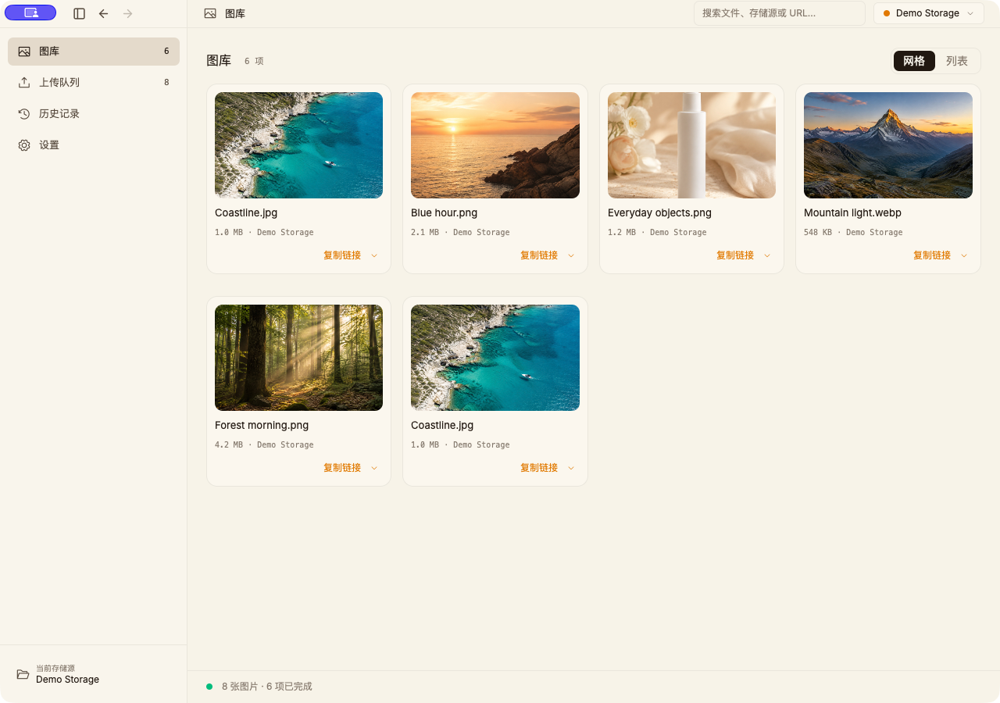

<div align="center">
  
  <h1>img</h1>
  <p><strong>A native image uploader</strong></p>
  <p>Upload images to your own storage and generate links for your documents.<br>Native desktop app, standalone CLI, and Agent Skill for macOS, Windows, and Linux.</p>
  <p><a href="https://liyown.github.io/img/en/install/#gui"><strong>Download desktop</strong></a> · <a href="https://liyown.github.io/img/en/install/#cli">Download CLI</a> · <a href="https://liyown.github.io/img/en/">Website</a> · <a href="https://liyown.github.io/img/en/docs/">Docs</a> · <a href="README.md">中文</a></p>

[](https://github.com/liyown/img/actions/workflows/desktop-release.yml)
[](https://github.com/liyown/img/actions/workflows/release.yml)
[](Cargo.toml)

</div>

[](https://liyown.github.io/img/en/install/#gui)

## Features

img is built in Rust. The GPUI desktop app bundles the matching CLI, with shared storage configuration and image processing across desktop uploads, editor integrations, and automation. The standalone CLI runs without the desktop app or a language runtime.

- Quick uploads: import files, clipboard images, screenshots, or remote URLs. Upload directly with a shortcut and copy the result as a URL, Markdown, or another format.
- Your own storage: connect R2, S3, OSS, GitHub, or HTTP hosts. Keep your public domain and select storage per project.
- Local gallery: search and preview desktop upload records, switch between grid and list, and copy links in batches across search results.
- Image processing: optimize, resize, or remove JPEG EXIF before batch uploads while preserving original files.
- Article migration: use `img rewrite` to upload local and remote Markdown images, replacing references while preserving alt text and titles.
- Automation: read per-file JSON results and exit codes from the native CLI, or use the companion Skill with an AI agent.

## Installation

Download the latest stable release from the [installation page](https://liyown.github.io/img/en/install/#gui). Desktop packages include the CLI, which is also available separately. No source build is required.

| System | Desktop, including CLI | Standalone CLI |
| --- | --- | --- |
| macOS 13+ | Apple silicon / Intel · DMG, ZIP | ARM64 / x64 |
| Windows 10/11 | x64 · EXE installer, portable ZIP | x64 |
| Ubuntu 24.04 / Debian 13+ | x64 · DEB | Linux ARM64 / x64 |

GitHub Actions builds, tests, and publishes native packages with SHA-256 checksums. [All releases](https://github.com/liyown/img/releases) · [Verification record](desktop/install-qa.md)

<details>
<summary>Community builds and platform notes</summary>

- macOS builds are not Apple-notarized. After verifying the source, use System Settings → Privacy & Security → Open Anyway if blocked. [Installation guide](https://liyown.github.io/img/en/install/#gui)
- Windows community packages are not code-signed. Linux GUI requires a graphical desktop, Vulkan drivers, and an unlocked Secret Service.
- Linux global shortcuts require X11; use window controls on Wayland. Screenshots require a system capture tool. Windows currently captures the full screen. Menu-bar background uploads are available on macOS.
- Settings → About and updates checks for and downloads verified updates, preserving configuration and the library. Rerun the installer to update the standalone CLI.

</details>

## Quick start

### Desktop app

1. Install img, add your image host in Settings → Storage, and set it as default.
2. Copy an image and press the upload shortcut.
3. Paste the link after the upload completes. Select Markdown, URL, or another output format in Settings.

| Action | macOS | Windows / Linux X11 |
| --- | --- | --- |
| Upload clipboard and copy link | `⌘⌥U` | `Ctrl+Alt+U` |
| Capture, upload, and copy link | `⌘⌥S` | `Ctrl+Alt+S` |

You can also select files, paste images, or add remote URLs in the window, review the queue, and click Upload.

### Command line

Download the [standalone CLI](https://liyown.github.io/img/en/install/#cli), or add the terminal command from the desktop app's About and updates section:

```sh
img init                                  # Connect your image host
img photo.png --format markdown --copy     # Upload and copy a Markdown link
img upload a.png b.jpg --format json       # Batch upload for scripts
img rewrite article.md --stdout            # Upload article images and print rewritten Markdown
```

Example output; the URL depends on your storage configuration:

```markdown

```

[R2 / OSS / GitHub setup examples](docs/cli.en.md#setup) · [Full command reference](docs/cli.en.md)

## Automation and AI agents

The standalone CLI works with scripts, editors, and AI agents. JSON output includes each file's upload result; exit codes indicate failure. Successful URLs remain available when a batch partially fails.

```sh
img upload ./assets/chart.png --format json --no-copy
```

The [img-uploader Skill](skills/img-uploader) defines file checks, configuration validation, uploads, and result parsing. Assistants that support Agent Skills and local command execution can use it to upload screenshots or charts and reference them in documents.

```sh
npx skills add liyown/img --skill img-uploader
```

Install the CLI and configure a default storage provider first. Credentials come from local configuration rather than prompts. [Skill reference](skills/img-uploader/SKILL.md) · [JSON output and exit codes](docs/cli.en.md#json-output)

## Editors and workflows

| Workflow | Integration |
| --- | --- |
| Blog posts and notes | Capture, upload, and paste the copied link into Markdown |
| Typora | Set the custom upload command to `img "${filepath}"` |
| Obsidian | Run `img serve` and connect the Image Auto Upload plugin to the PicGo-compatible service |
| Article migration | Use `img rewrite` for local and remote images while preserving alt text and titles |
| Agent workflows | Read structured CLI JSON and reuse configured storage with the companion Skill |

[Integration examples](docs/cli.en.md#integrations) · [Agent Skill](skills/img-uploader) · [GitHub Action](action.yml)

### Existing storage configuration

Add your existing provider settings to img, verify an upload and its public URL, then update your editor's upload command. Changing the client does not affect links in existing articles.

Automatic imports of other clients' configuration and history are not supported. The gallery manages local records; clearing them preserves original files and remote images. Remote file management and PicGo plugin compatibility are outside the current scope.

## Storage and formats

**Cloudflare R2 · S3-compatible services · Alibaba Cloud OSS · GitHub repositories · Custom HTTP endpoints**

PNG, JPEG, GIF, WebP, SVG, and AVIF are supported. Select storage per project and set defaults for output formats and image processing. [Storage guide](https://liyown.github.io/img/en/docs/storage/)

## Development and feedback

Found a problem? Include your OS, img version, and reproduction steps, without storage credentials. [Report an issue or request a feature](https://github.com/liyown/img/issues)

```sh
git clone https://github.com/liyown/img.git
cd img
cargo test --locked --workspace
```

Explore the [shared upload core](crates/img-core), [standalone CLI](crates/img-cli), and [native desktop app](desktop). [Build and release guide](desktop/RELEASING.md)
